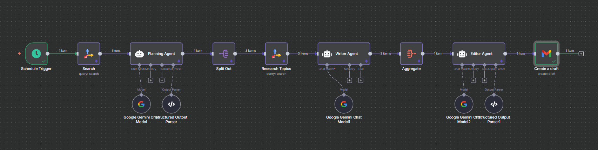
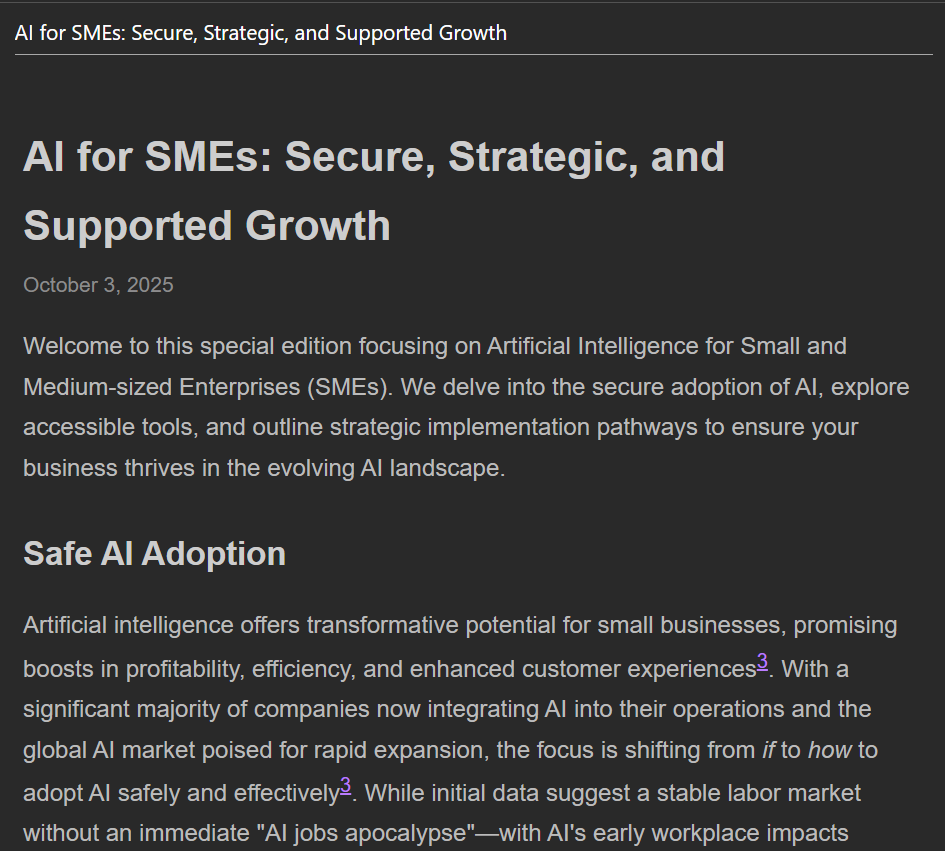

# AI-Powered Newsletter Automation with n8n

> A multi-agent workflow that automatically researches, writes, and formats professional newsletters using AI agents orchestrated through n8n.



## 🎯 What This Does

This workflow automates the entire newsletter creation process:

- **Researches** recent news in your chosen niche
- **Plans** edition structure with AI (title + 3 topics)
- **Writes** detailed sections with proper citations
- **Edits & formats** into responsive HTML
- **Creates** a Gmail draft ready for human review

**Time saved:** ~3-4 hours per newsletter edition

## 🏗️ Architecture

```
Schedule Trigger (Weekly)
  ↓
Initial Research (Tavily API)
  ↓
Planning Agent (Gemini) → generates title + 3 topics
  ↓
Split Topics → 3 parallel branches
  ↓
Topic Research (Tavily) → deeper research per topic
  ↓
Section Writer Agent (Gemini) → writes 3 sections
  ↓
Aggregate Sections
  ↓
Editor Agent (Gemini) → formats to HTML + subject line
  ↓
Create Gmail Draft
```

### Agent Breakdown

| Agent              | Model          | Purpose                            | Output                    |
| ------------------ | -------------- | ---------------------------------- | ------------------------- |
| **Planning Agent** | Gemini 2.5 Pro | Analyzes trends, creates structure | JSON: title + 3 topics    |
| **Section Writer** | Gemini 2.5 Pro | Writes detailed sections (3x)      | Markdown with citations   |
| **Editor Agent**   | Gemini 2.5 Pro | Formats HTML, creates subject      | JSON: subject + HTML body |

## 🚀 Quick Start

### Prerequisites

1. **n8n instance** (cloud or self-hosted)
2. **API Keys:**
   - [Tavily API](https://tavily.com) - for web search
   - [Google AI Studio](https://aistudio.google.com) - for Gemini API
   - Gmail OAuth credentials

### Installation

1. **Clone this repository:**

   ```bash
   git clone https://github.com/YOUR_USERNAME/n8n-newsletter-automation.git
   ```

2. **Import workflow into n8n:**

   - Open n8n
   - Click "Add workflow" → "Import from file"
   - Select `newsletter-workflow.json`

3. **Configure credentials:**

   - Add Tavily API key
   - Add Gemini API credentials
   - Connect Gmail account (OAuth)

4. **Customize for your niche:**

   - Edit the "Initial Research" node query
   - Adjust system prompts in agent nodes
   - Set your target email in "Create Draft" node

5. **Test run:**
   - Disable the Schedule Trigger
   - Click "Execute Workflow" manually
   - Check Gmail drafts folder

## ⚙️ Configuration

### Changing the Newsletter Niche

Edit the **Initial Research** node:

```javascript
// Current: AI adoption for small businesses
Query: "AI adoption for small businesses";

// Examples:
// "sustainable fashion trends"
// "remote work productivity tools"
// "fintech innovations for SMBs"
```

### Adjusting Output Length

Modify system prompts in agents:

- **Section Writer**: Change "350-500 words" to your preference
- **Editor**: Adjust HTML structure requirements

### Cost Optimization

- Use Gemini Flash for Section Writer (cheaper)
- Reduce `max_results` in Tavily searches
- Lower temperature (0.3-0.5) for consistency

## 📊 Sample Output

### Generated Topics Example:

```json
{
  "title": "AI in Action: Small Business Wins This Week",
  "topics": [
    "AI chatbots boost customer service",
    "Automated inventory management tools",
    "Marketing automation ROI studies"
  ]
}
```



## 🛠️ Tech Stack

- **n8n** - Workflow automation platform
- **Tavily API** - Web search & content extraction
- **Google Gemini** - AI agent models
- **Gmail API** - Draft creation

## 📝 Workflow Features

- ✅ Structured output parsing (JSON schemas)
- ✅ Parallel processing (3 topics simultaneously)
- ✅ Automatic citation formatting
- ✅ Responsive HTML email generation
- ✅ Human-in-the-loop (draft review before send)
- ⏳ Error handling (coming soon)
- ⏳ Cost tracking (coming soon)

## 🎓 Learning Resources

This project was built following [this tutorial](https://www.youtube.com/watch?v=pxzo2lXhWJE) and enhanced with:

- Production-ready prompts
- Structured output schemas
- Custom formatting logic

### Key Learnings

1. **Prompt engineering matters**: Specific, constrained prompts = consistent output
2. **Structured outputs are essential**: JSON schemas prevent format drift
3. **Human review is crucial**: AI drafts still need editorial oversight
4. **Cost awareness**: Monitor API calls, use appropriate model tiers

## 🔧 Customization Ideas

- [ ] Add fallback search providers (Bing, SERP API)
- [ ] Implement approval workflow (webhook + Google Sheets)
- [ ] Multi-language support
- [ ] A/B test different prompt variations
- [ ] Add analytics tracking (open rates, click-through)
- [ ] Export to Mailchimp/Substack instead of Gmail

## 🐛 Troubleshooting

**Issue: HTML shows as plain text in email**

- Solution: Ensure Gmail node "Email Type" is set to "HTML"

**Issue: Timeout errors**

- Solution: Reduce Tavily `max_results`, use faster Gemini models

**Issue: Inconsistent topic generation**

- Solution: Lower temperature (0.3), strengthen JSON schema validation

## 📄 License

MIT License - feel free to use and modify for your projects

## 🤝 Contributing

Issues and pull requests welcome! Areas for improvement:

- Error handling strategies
- Alternative AI models
- Template variations
- Performance optimizations

## 📬 Contact

Connect on LinkedIn: [linkedin.com/in/ZohaibCodez](https://linkedin.com/in/ZohaibCodez)

Project Link: [https://github.com/ZohaibCodez/n8n-newsletter-automation](https://github.com/ZohaibCodez/n8n-newsletter-automation)

---

⭐ If this helped you, consider giving it a star!

Built with ☕ and 🖤
